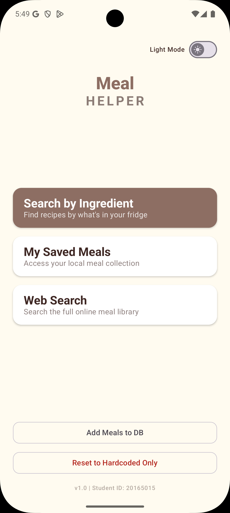
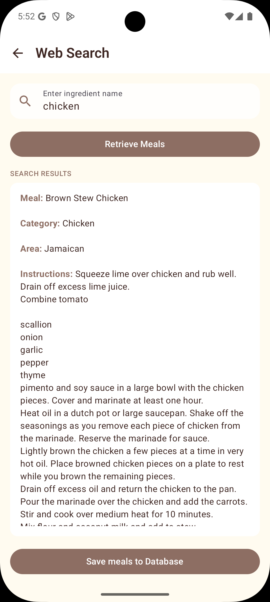
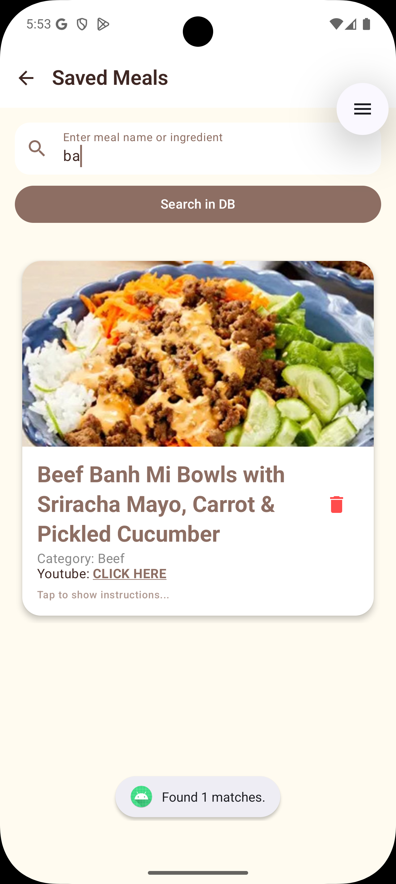
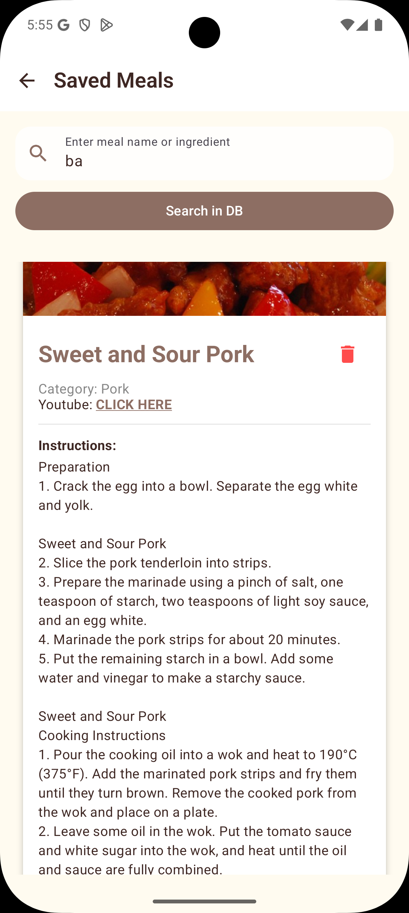
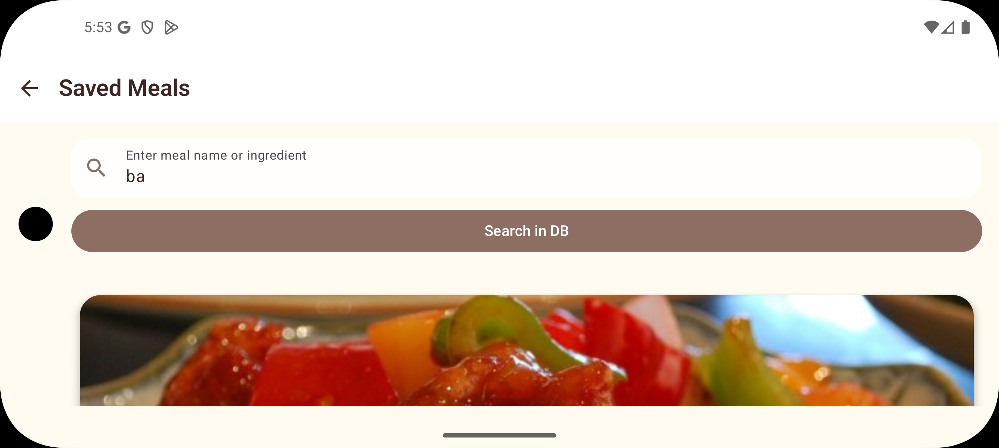
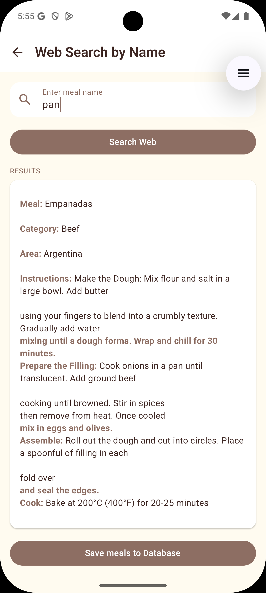
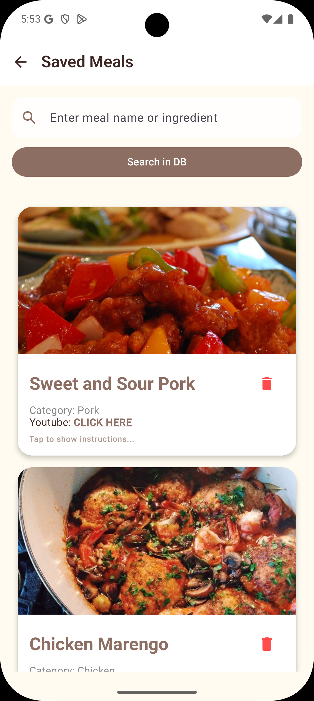

# 🥘 Meal Helper Android App

An Android application built with **Kotlin** and **Jetpack Compose** that allows users to search, view, and manage recipes using both a remote API and a local Room database.

---

## 🚀 Features

- **Modern UI:** Built with Jetpack Compose and Material 3, supporting dark and light themes  
- **Hybrid Data Source:** Combines online recipe data (API) with offline local storage (Room database)  
- **Search Functionality:** Search recipes via API or filter locally stored data  
- **Offline Access:** Save and access recipes without an internet connection  
- **Expandable Recipe Views:** Displays detailed cooking instructions in an interactive UI  
- **Data Management:** Add, delete, and reset locally stored recipes  
- **Responsive Design:** Supports different screen sizes and orientation changes  

---

## 🛠 Tech Stack

- **Language:** Kotlin  
- **UI:** Jetpack Compose  
- **Architecture:** MVVM  
- **Database:** Room (SQLite abstraction)  
- **Concurrency:** Kotlin Coroutines  
- **Networking:** HttpURLConnection  
- **JSON Parsing:** org.json  
- **API:** TheMealDB  

---

## 📱 App Walkthrough

| Home Screen | Web Search | Local Collection | Instructions |
| :---: | :---: | :---: | :---: |
|  |  |  |  |
| **Main Menu** | **API Search** | **Saved Meals** | **Expandable Card** |

| Rotation Support | Web Search Results | Extra Collection View | Theme Support |
| :---: | :---: | :---: | :---: |
|  |  |  |  |
| **Landscape Mode** | **Results List** | **Local DB** | **Dark/Light Mode** |


## 📁 Project Structure

```text
com.example.mealcw/
├── MainActivity.kt      # Navigation + app entry point
├── MealViewModel.kt     # State management and business logic
├── MealDao.kt           # Database queries (Room)
├── Meal.kt              # Data model
├── MealData.kt          # Initial dataset
└── ui/theme/            # UI theme configuration
